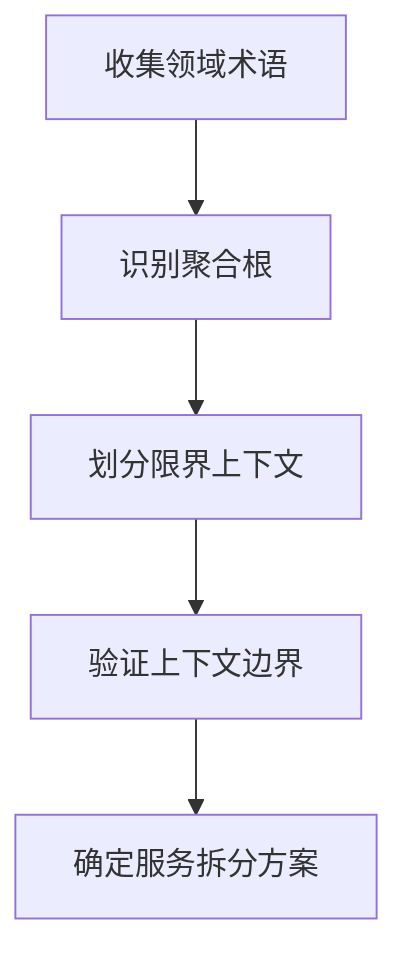

## 前言

微服务架构已成为现代后端系统的主流选择，但在实际落地过程中，许多团队面临着"何时拆"、"如何拆"、"拆到什么程度"的困惑。本文基于我们团队从单体架构迁移到微服务架构的两年实践，总结了一套可复制的拆分方法论，以及在拆分过程中踩过的坑。

## 一、微服务拆分的时机判断

### 1.1 明确的拆分信号

**团队规模信号**
- 开发团队超过10-15人，单体应用部署协调成本显著上升
- 不同功能模块的代码冲突频繁，合并代码成为负担

**业务复杂度信号**
- 业务域边界清晰，可以识别出相对独立的业务能力
- 不同模块的发布节奏差异明显（有的模块需要频繁发布，有的则相对稳定）

**技术债务信号**
- 单体应用启动时间超过5分钟，严重影响开发效率
- 内存占用持续增长，垂直扩展成本过高
- 单点故障风险无法接受，需要对核心模块进行隔离

### 1.2 常见的伪信号（值得警惕）

- "大家都用微服务，所以我们也要用" —— 盲目跟风
- "微服务看起来更先进" —— 技术炫技
- "为了学习微服务而拆分" —— 学习成本转嫁给项目

## 二、领域驱动设计（DDD）指导下的服务拆分

### 2.1 识别限界上下文

限界上下文是领域模型的边界，也是微服务拆分的天然边界。我们通过以下步骤识别：



**实践案例：电商订单系统**

错误拆分（按技术层次）：
```
- 用户服务（User Service）
- 订单服务（Order Service）
- 支付服务（Payment Service）
- 库存服务（Inventory Service）
```

这种拆分看似合理，但实际上**订单服务**和**支付服务**之间耦合严重，订单状态变更需要同步更新支付状态，导致分布式事务复杂度呈指数级上升。

正确拆分（按业务能力）：
```
- 交易上下文（Trading Context）：处理下单、支付、退款
- 履约上下文（Fulfillment Context）：处理库存、发货、退货
- 用户上下文（User Context）：用户信息、账户管理
- 商品上下文（Product Context）：商品信息、价格管理
```

### 2.2 避免分布式单体陷阱

**反模式示例**：

```go
// 错误：服务间直接调用数据库
func (s *OrderService) CreateOrder(ctx context.Context, req *CreateOrderRequest) error {
    // 创建订单
    order := &Order{...}
    if err := s.db.Create(order); err != nil {
        return err
    }

    // 直接调用用户服务数据库（反模式！）
    user, err := s.userDB.GetUser(req.UserID)
    if err != nil {
        return err
    }

    // 直接调用库存服务数据库（反模式！）
    inventory, err := s.inventoryDB.GetProduct(req.ProductID)
    if err != nil {
        return err
    }

    return nil
}
```

这种做法虽然避免了跨服务调用，但带来了更严重的问题：
1. 数据库耦合，无法独立扩展
2. 跨服务的数据一致性难以保证
3. 失去了微服务独立部署的优势

**正确做法**：通过领域事件进行最终一致性协调

```go
func (s *OrderService) CreateOrder(ctx context.Context, req *CreateOrderRequest) error {
    // 1. 创建订单
    order := &Order{
        ID:        generateID(),
        UserID:    req.UserID,
        ProductID: req.ProductID,
        Status:    "pending",
    }
    if err := s.db.Create(order); err != nil {
        return err
    }

    // 2. 发布订单创建事件
    event := &OrderCreatedEvent{
        OrderID:   order.ID,
        UserID:    order.UserID,
        ProductID: order.ProductID,
        Timestamp: time.Now(),
    }
    if err := s.eventBus.Publish("order.created", event); err != nil {
        // 本地消息表保证消息不丢失
        s.saveToOutbox(event)
    }

    return nil
}
```

## 三、服务拆分的渐进式策略

### 3.1 绞杀者模式（Strangler Pattern）

不要试图一次性重写整个系统，而是通过逐步替换的方式：

```
阶段1: 新功能使用微服务架构，老功能保持单体
阶段2: 识别高变更频率的模块，优先拆分
阶段3: 识别性能瓶颈模块，独立拆分优化
阶段4: 逐步替换剩余模块
```

**实践技巧**：使用 API Gateway 实现流量路由

```yaml
# API Gateway 路由配置
routes:
  - path: /api/v1/orders/*
    service: monolith  # 旧系统
  - path: /api/v1/orders/new
    service: order-service  # 新服务（逐步迁移）
  - path: /api/v1/users/*
    service: user-service  # 已拆分的服务
```

### 3.2 数据库拆分的双写策略

在数据迁移过程中，使用双写策略保证数据一致性：

```go
type OrderRepository struct {
    mainDB    *sql.DB    // 单体数据库
    shardDB   *sql.DB    // 新的拆分数据库
    migrator  *DataMigrator
}

func (r *OrderRepository) Create(order *Order) error {
    // 1. 写入旧数据库（保证兼容）
    if err := r.mainDB.Create(order); err != nil {
        return err
    }

    // 2. 异步写入新数据库
    go func() {
        if err := r.shardDB.Create(order); err != nil {
            r.migrator.RecordFailure(order.ID, err)
        }
    }()

    return nil
}

// 读取时优先从新数据库读取，失败则降级到旧数据库
func (r *OrderRepository) Get(id string) (*Order, error) {
    if order, err := r.shardDB.Get(id); err == nil {
        return order, nil
    }
    return r.mainDB.Get(id)
}
```

## 四、常见陷阱与避坑指南

### 4.1 过度拆分

**症状**：
- 服务数量超过50个，单个服务代码量不足1000行
- 任何业务变更都需要修改3个以上服务
- 团队成员每人负责5个以上服务，认知负担过重

**解决方案**：
- 设定最小服务规模：至少2个工程师全职维护
- 定期审查服务拆分的合理性，合并过小的服务
- 引入服务合并机制：当两个服务总是需要一起发布时，考虑合并

### 4.2 忽视数据一致性

**问题**：拆分后如何保证跨服务事务？

**方案1：Saga 模式（长活事务）**

```go
type OrderSaga struct {
    steps []SagaStep
}

type SagaStep struct {
    Execute    func(ctx context.Context) error
    Compensate func(ctx context.Context) error
}

func (s *OrderSaga) Execute(ctx context.Context) error {
    executedSteps := []int{}

    for i, step := range s.steps {
        if err := step.Execute(ctx); err != nil {
            // 执行失败，执行补偿操作
            for j := i - 1; j >= 0; j-- {
                s.steps[j].Compensate(ctx)
            }
            return err
        }
        executedSteps = append(executedSteps, i)
    }

    return nil
}
```

**方案2：基于事件的状态机**

```go
type OrderStateMachine struct {
    currentState string
    transitions  map[string][]Transition
}

type Transition struct {
    Event    string
    Action   func() error
    NextState string
}

func (sm *OrderStateMachine) Handle(event string) error {
    transitions := sm.transitions[sm.currentState]
    for _, t := range transitions {
        if t.Event == event {
            if err := t.Action(); err != nil {
                return err
            }
            sm.currentState = t.NextState
            return nil
        }
    }
    return ErrInvalidTransition
}
```

### 4.3 分布式追踪缺失

**问题**：微服务架构下，一个请求可能经过多个服务，如何快速定位问题？

**方案**：引入 OpenTelemetry 实现分布式追踪

```go
import (
    "go.opentelemetry.io/otel"
    "go.opentelemetry.io/otel/trace"
)

func (s *OrderService) CreateOrder(ctx context.Context, req *CreateOrderRequest) error {
    // 创建 Span
    ctx, span := otel.Tracer("order-service").Start(ctx, "CreateOrder")
    defer span.End()

    // 添加属性
    span.SetAttributes(
        attribute.String("user.id", req.UserID),
        attribute.String("product.id", req.ProductID),
    )

    // 调用其他服务时自动传递 trace context
    inventory, err := s.inventoryClient.CheckStock(ctx, req.ProductID)
    if err != nil {
        span.RecordError(err)
        return err
    }

    return nil
}
```

## 五、服务拆分的评估指标

### 5.1 定量指标

| 指标 | 单体架构 | 微服务架构 | 目标 |
|------|---------|-----------|------|
| 部署频率 | 1次/周 | 10次/周 | 提升10倍 |
| 故障恢复时间 | 30分钟 | 5分钟 | 降低80% |
| 代码构建时间 | 15分钟 | 3分钟 | 降低80% |
| 团队自治度 | 30% | 80% | 提升50% |

### 5.2 定性评估

- **开发体验**：开发者是否可以本地启动完整的服务？
- **运维复杂度**：监控、日志、故障排查的难度是否可接受？
- **组织架构**：团队结构与服务边界是否匹配（康威定律）？

## 六、总结与展望

微服务架构不是银弹，它是一把双刃剑。在享受其带来的灵活性和可扩展性的同时，也要承担分布式系统带来的复杂度。

**核心建议**：
1. 从业务价值出发，而非技术潮流
2. 采用渐进式拆分，而非推倒重来
3. 重视服务治理，避免"微服务单体"
4. 建立完善的可观测性体系
5. 持续评估和调整，保持架构演进的活力

**下一步探索**：
- Service Mesh 在生产环境的实践
- Serverless 架构下的服务拆分新模式
- AI 辅助的微服务边界识别

---

> 作者注：本文基于我们团队两年来的实践总结，每个观点都伴随着真实的血泪教训。如果你的团队正在考虑微服务化，希望这些经验能帮你少走弯路。
